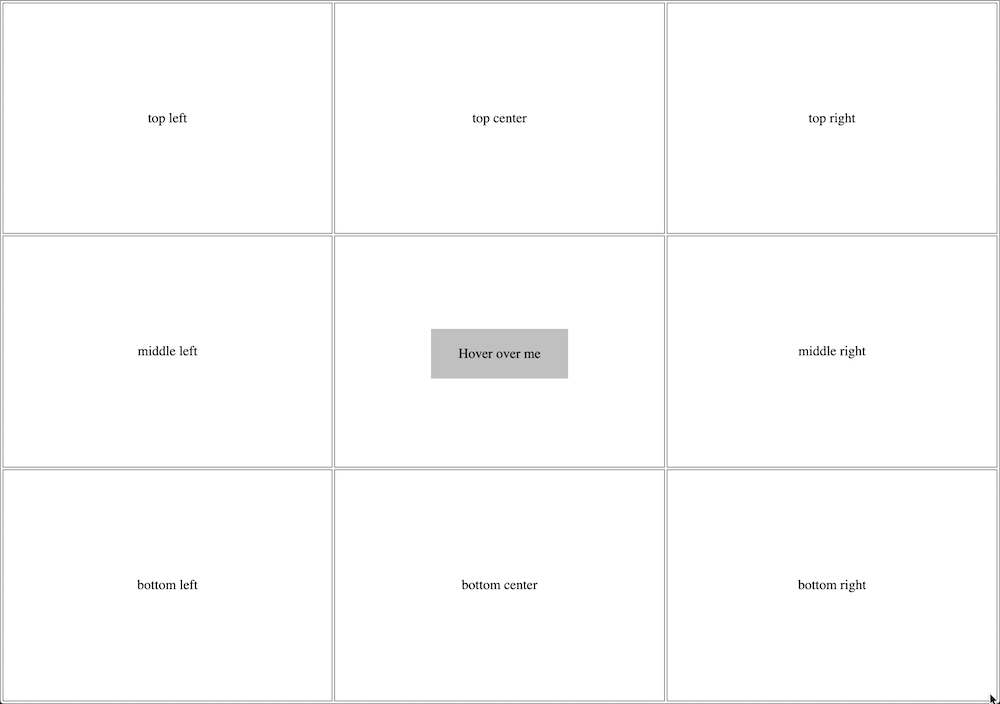

# @zestia/ember-async-tooltips

<a href="http://emberobserver.com/addons/ember-async-tooltips"></a> &nbsp; <a href="https://david-dm.org/zestia/ember-async-tooltips#badge-embed"></a> &nbsp; <a href="https://david-dm.org/zestia/ember-async-tooltips#dev-badge-embed"></a> &nbsp; <a href="http://travis-ci.org/zestia/ember-async-tooltips"></a>

### Installation
```
ember install @zestia/ember-async-tooltips
```

### Demo

https://zestia.github.io/ember-async-tooltips

<a href="https://zestia.github.io/ember-async-tooltips">
  
</a>

### Notes

* Does not use jQuery

### Example

When `example-tool-tipper` is hovered over, the `example-tool-tip` component will be rendered in a place of your chosing in the DOM.

```handlebars
<ExamplToolTipper @tooltip={{component "example-tool-tip"}}>
  Hover over me
</ExampleToolTipper>
```

Tooltips will be rendered here:

```handlebars
<RenderActiveTooltips />
```

### Features

* [Manual positioning](#manual-positioning) either: N, NE, E, SE, S, SW, W, NW
* [Automatic positioning](#automatic-positioning): Viewport is split into rows and columns which help determine where a tooltip should be optimally positioned
* Can specify delay before the tooltip will show/hide on a per-tooltip or per-class basis
* Can optionally wait for async data to be loaded and passed to the tooltips without negatively affecting the hover delay.

### Prerequisites

1. It is assumed that all your tooltips will animate in and out. For this reason
  you are required to add the following styles:

  ```css
  .your-tooltip.is-showing {
    animation: your-show-animation;
  }

  .your-tooltip.is-hiding {
    animation: your-hide-animation;
  }
  ```

2. In order to detect when a tooltip has animated out your application must be
   informed of animation events. Add the following to `app/app.js`

  ```javascript
  customEvents: {
    webkitAnimationEnd: 'animationEnd',
    msAnimationEnd: 'animationEnd',
    oAnimationEnd: 'animationEnd',
    animationend: 'animationEnd'
  }
  ```

### Recommended usage

It is recommended that you don't use `tool-tip` and `tool-tipper` components directly, but instead extend them to create your own.

For example, the following configuration creates a new tooltip that:
* Has custom automatic positioning: NW, N, NE, SE, S, SW.
  Excludes W and E - useful if you don't want to add CSS for these positions.
* Has a custom hover delay (won't display the user tooltip until after 300ms has passed)
* Loads the user _during_ the alotted hover delay time period, or extending the delay if it wasn't retreived in time


```javascript
// user-tool-tipper.js
import ToolTipperComponent from '@zestia/ember-async-tooltips/components/tool-tipper';

export default ToolTipperComponent.extend({
  classNames: ['user-tooltipper'],
  showDelay: 300
  hideDelay: 0
});
```

```javascript
// user-tool-tip.js
import ToolTipComponent from '@zestia/ember-async-tooltips/components/tool-tip';

export default ToolTipComponent.extend({
  classNames: ['user-tooltip'],
  columns: 3,
  rows: 2
});
```

```handlebars
  {{! application.hbs }}
  <UserToolTipper @onLoad={{action "loadUser" this.user.id}} @tooltip={{component "user-tool-tip"}}>
    {{this.user.name}}
  </UserToolTipper>
```

```handlebars
  {{! user-tool-tip.hbs }}
  Hello {{this.data.user.name}}
```

### Manual positioning

Setting the `position` argument will add `left` and `right` CSS properties based upon the compass points. This will position the `tool-tip` around the outside edge of the `tool-tipper` component that caused it to display.

```handlebars
  <ExampleToolTipper @tooltip={{component "example-tool-tip" position="NW"}} />
```

### Automatic positioning

The tooltip will be positioned around the outside edge of the `tool-tipper` component that caused it display by chosing the most appropriate compass point. For example: If the `tool-tipper` component is at the very bottom of the viewport (south), then the `tool-tip` component will be displayed _above_ the `tool-tipper` (north) - so as to remain visible.

```handlebars
  <ExampleToolTipper @tooltip={{component "example-tool-tip"}} />
```

### Manual showing/hiding

The tooltipper yields the ability to show or hide its tooltip.

```handlebars
  <ExampleToolTipper @tooltip={{component "example-tool-tip"}} as |tt|>
    <button onclick={{action tt.hideTooltip}}>Hide</button>
    <button onclick={{action tt.showTooltip}}>Show</button>
  </ExampleToolTipper>
```
